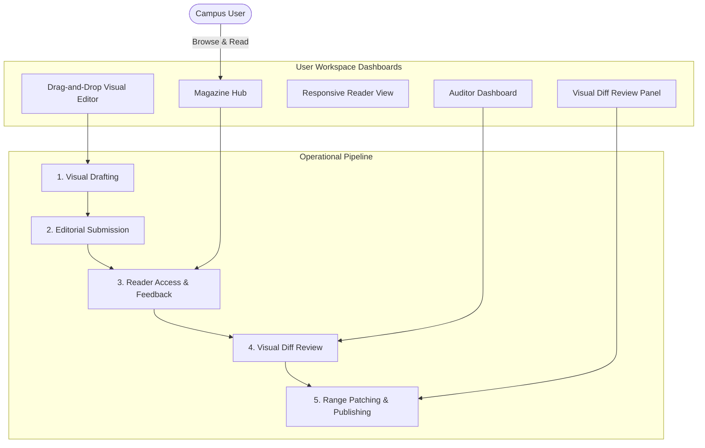
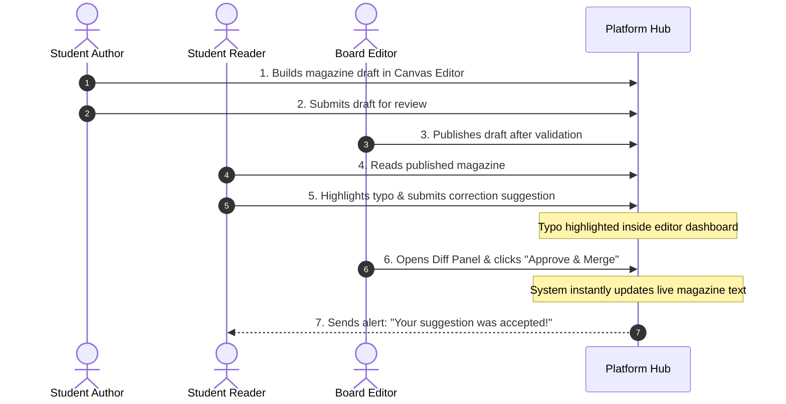

# CAMPUS E-MAGAZINE PLATFORM
## COMPREHENSIVE OPERATIONAL LIFECYCLE & PROJECT DOCUMENTATION
*Submitted in partial fulfillment of the requirements for the degree of Bachelor of Technology in Computer Science & Engineering*

---

### **PROJECT INFORMATION & METADATA**
* **Project Name**: Campus E-Magazine Platform
* **Project Type**: Collaborative Digital Publishing System
* **Primary Features**: Role-Based Dashboards, Drag-and-Drop Canvas Drafting, Range-Based Peer Suggestions, Dynamic Visual Auditing, Real-time Collaborative Alerts
* **Design Pillars**: Responsive HSL Typography, Glassmorphism Interfaces, Low-Latency WebSockets Synchronization, Secure CDN File Management
* **Target Audience**: Campus Student Bodies, Literary Clubs, Editorial Boards, and Academic Departments
* **Under Guidance Of**: Department Project Coordinator / Advisor

---

## **TABLE OF CONTENTS**
1. [Acknowledgement](#acknowledgement)
2. [Abstract](#abstract)
3. [Introduction](#introduction)
4. [Problem Statement](#problem-statement)
5. [Objectives of the Project](#objectives-of-the-project)
6. [Existing System Analysis](#existing-system-analysis)
7. [Proposed Collaborative Platform](#proposed-collaborative-platform)
8. [User Roles & Dashboard Segmentation](#user-roles)
9. [End-to-End Operational Lifecycle (Start to Finish)](#operational-lifecycle)
10. [Visual Layout Editor & Content Assembly](#visual-editor)
11. [Peer Suggestion & Feedback Mechanism](#peer-suggestion)
12. [Editorial Auditing & Visual Merging Flow](#editorial-moderation)
13. [UI View Layouts & User Experience Walkthrough](#ui-walkthrough)
14. [Operational Advantages](#advantages)
15. [Practical Limitations](#limitations)
16. [Future Enhancements](#future-enhancements)
17. [Conclusion](#conclusion)
18. [References](#references)

---

## **1. ACKNOWLEDGEMENT**

I express my deepest gratitude to my project coordinator and advisor for their invaluable guidance, constant encouragement, and structural feedback throughout the conceptualization and workflow design phases of the **Campus E-Magazine Platform**. Their insights into collaborative publishing workflows, user role delegation, and human-centric software interface systems were instrumental in shaping the conceptual direction of this project.

I also extend my sincere appreciation to the Department of Computer Science & Engineering and my peers for providing a highly collaborative and intellectually stimulating environment. Finally, I would like to thank my family and friends for their support, which motivated me to pursue this project to its successful completion.

---

## **2. ABSTRACT**

Academic campuses frequently struggle to aggregate, curate, and publish literary and journalistic contributions from students in an engaging, cost-effective manner. Traditional print mediums are economically unsustainable for frequent releases, while static PDF files completely lack visual appeal, mobile responsiveness, and collaborative feedback loops.

This report presents the **Campus E-Magazine Platform**, a unified digital ecosystem designed to streamline campus publishing from initial manuscript drafting to final reader delivery. Centered on a modern, user-friendly interface, the platform provides dedicated workspaces for **Readers, Authors, Co-Editors, and Administrators**. Authors utilize a dynamic, drag-and-drop **Canvas Editor** to design multi-page magazine layouts without technical layout skills.

The core highlight of the platform is its custom **"Audit & Merge" collaboration pipeline**. Readers can highlight any sentence directly within the magazine viewer and submit edit suggestions. The system alerts editors via real-time notifications, overlaying the changes on a dedicated review panel. Administrators inspect these recommendations, select the best proposals, and merge them immediately into the live edition. This document details this end-to-end collaborative lifecycle, illustrating how the platform enhances student journalism, reduces coordination friction, and transforms campus publications.

---

## **3. INTRODUCTION**

Student-led journalism and creative writing are the cultural cornerstones of any academic campus. Historically, these expressions have been captured via traditional print magazines. However, rising printing costs, paper shortages, and delays in distribution have made print media increasingly difficult to sustain. 

While transitioning to PDF editions has solved printing costs, it has introduced serious user experience issues. PDFs are rigid, do not scale elegantly on mobile screens, and offer no interactivity. More importantly, the operational process behind compiling these publications remains manual and chaotic—relying on countless emails, fragmented Word documents, and slow back-and-forth communication.

The **Campus E-Magazine Platform** solves these challenges by providing a secure, web-based digital publishing platform. It features structured role hierarchies, interactive canvas editors, inline review capabilities, and real-time synchronization. This document explains the operational layout of the platform, demonstrating how a student’s draft is seamlessly refined, approved, published, and polished through collaborative participation.

---

## **4. PROBLEM STATEMENT**

The existing methods for managing and publishing campus publications suffer from several operational bottlenecks:

1. **Fragmented Editorial Workflows**: The review pipeline between authors and editors is highly manual. Logistical friction (such as emailing revisions back and forth) causes major delays in magazine releases.
2. **Static and Rigid Reader Formats**: Static PDFs fail to adapt to modern mobile viewports, leading to poor readability and a complete lack of student engagement.
3. **No Direct Path for Peer Feedback**: Standard readers have no intuitive way to provide constructive edits or call out typos. Feedback is typically lost in casual chats, leaving published mistakes uncorrected.
4. **Lack of Centralized Moderation Controls**: Shared folders and public editing tools (like Google Docs) lack structure. They do not allow you to restrict editing access, nor do they support formal organizational check-off procedures.
5. **Complicated Editing Tasks**: Editors must manually locate, verify, and copy-paste changes from comments back into a main layout document, which is slow and prone to errors.

---

## **5. OBJECTIVES OF THE PROJECT**

The primary objectives of the **Campus E-Magazine Platform** are:

* **To establish a unified, secure digital platform** that centralizes the creation, curation, and reading of campus magazines.
* **To build an intuitive visual editor** that enables student authors to compile layouts, rich text blocks, and images without needing coding experience.
* **To create a range-based "Suggest Edit" system** that allows campus readers to highlight text and suggest improvements directly within the reading interface.
* **To introduce a visual "Audit & Merge" control panel** for editors to instantly apply approved peer corrections to the live publication.
* **To enforce clear Role-Based Access Control (RBAC)** to secure the publishing workflow.
* **To incorporate real-time alerts** so that team members are notified instantly when a suggestion is submitted, accepted, or published.

---

## **6. EXISTING SYSTEM ANALYSIS**

Before designing the new platform, a thorough analysis of current publishing workflows was conducted:

### **6.1 The Traditional Print Model**
* **Workflow**: Drafts are compiled manually, formatted in publishing software (e.g., InDesign), printed, and physically distributed.
* **Limitations**: High printing costs, slow distribution, zero reader analytics, and no way to fix post-print spelling errors.

### **6.2 The Static PDF / Email Model**
* **Workflow**: Authors email text files, editors manually compile them into a PDF, and the final file is shared on campus social media groups.
* **Limitations**: Hard to read on phones, zero interactive elements, and editing suggestions must be handled via manual follow-up emails.

### **6.3 Standard Blogging Engines**
* **Workflow**: Writers upload standalone blog posts, and editors click publish.
* **Limitations**: Lacks unified "magazine edition" formatting, does not support inline peer edit suggestions, and lacks dashboard segmentation for campus roles.

---

## **7. PROPOSED COLLABORATIVE PLATFORM**

The proposed **Campus E-Magazine Platform** addresses these challenges by introducing an end-to-end digital pipeline:

### **Core Collaborative Features**
* **Dynamic Role Upgrades**: Standard readers can instantly request to become authors, allowing anyone on campus to contribute drafts.
* **Visual Diff Highlighter**: Editors can review changes in a side-by-side view where additions are highlighted in green and deletions in red, removing all manual layout editing work.
* **Live System Syncing**: Connected users receive immediate notifications when updates are made, keeping writers, editors, and readers connected.

---

## **8. USER ROLES & DASHBOARD SEGMENTATION**

The platform uses a role-based access control system to define permissions and keep workspaces clean and focused:

| User Role | Dashboard Privileges & Access Scope |
| :--- | :--- |
| **Reader** | * Can browse and read published magazine editions. * Can select text in the reader interface to submit inline edit suggestions. * Receives real-time system alerts when their suggestions are accepted. |
| **Author** | * Has all Reader privileges. * Can access the custom visual canvas editor. * Can create, edit, save, and submit own magazine drafts for editorial review. |
| **Co-Admin** | * Can access the central administration dashboard. * Can review pending drafts, approve submissions, and write feedback comments. * Can inspect reader suggestions and visually merge them into published content. |
| **Super-Admin** | * Has full system-wide administrative control. * Can manage, promote, or deactivate co-admins and edit roles. * Can configure general platform settings and view system usage statistics. |

---

## **9. END-TO-END OPERATIONAL LIFECYCLE (START TO FINISH)**

The entire campus publishing journey is structured into six clear, collaborative phases:

### **Phase 1: Visual Drafting and Cover Design**
An author logs in, opens their author dashboard, and creates a new draft. Using the **Visual Layout Canvas**, they title the edition, choose layout containers, apply rich text styles, and upload cover images.

### **Phase 2: Editorial Submission**
Once the author is satisfied, they click "Submit for Review". The draft's status changes to `pending_review`, locking the layout to prevent further modifications while the editorial board evaluates it.

### **Phase 3: Review and Publication**
Editors inspect the submission from their pending queue. They can either approve and publish it immediately, or reject it and send it back to the author with detailed change requests.

### **Phase 4: Reader Access and Inline Suggestions**
Once published, the magazine appears on the main feed for the campus community. As readers browse the pages, they can highlight any text (like typos or grammar issues) and submit an improvement recommendation directly inside the reader interface.

### **Phase 5: Visual Auditing and Merging**
Suggestions instantly alert editors and update the magazine's status to `suggestions_pending`. Editors open the audit workspace to review recommendations, highlight the target text, and merge approved changes into the live magazine with a single click.

### **Phase 6: Automatic Updates and Reader Alerts**
Upon merging, the system automatically updates the live magazine text, notifies the reader who suggested the edit, and refreshes the viewport for everyone currently reading the magazine.

---

## **10. VISUAL LAYOUT EDITOR & CONTENT ASSEMBLY**

The visual layout editor simplifies content design for campus writers:

* **Container Assembly**: Authors arrange structural elements (headers, text blocks, columns, and spacing tools) within their canvas workspace.
* **Asset Manager**: A direct-upload system allows creators to drag-and-drop cover illustrations and photos. Images are automatically optimized and served via a high-performance content delivery network.
* **Real-time Canvas Rendering**: A live viewport shows exactly how text and media will look to readers, eliminating the need for slow draft exports.

---

## **11. PEER SUGGESTION & FEEDBACK MECHANISM**

The peer suggestion system allows readers to actively improve campus publications:

* **Text Selection**: Readers can highlight any sentence in the viewer to open a correction popup.
* **Correction Form**: The popup shows the selected text in a read-only field, and provides a text area for the reader's suggested replacement.
* **Collaborative Tracking**: Submitted recommendations are tied to the reader's profile, allowing the platform to credit them when their edits are merged.

---

## **12. EDITORIAL AUDITING & VISUAL MERGING FLOW**

The auditing dashboard serves as the command center for editors, automating the review and publishing process:

* **The Pending Queue**: Organizes submitted editions and displays active user feedback badges, showing editors where attention is needed.
* **The Visual Diff Panel**: Shows original sentences and proposed replacements side-by-side. Deletions are highlighted in red strike-through, and additions are shown in green, making comparison effortless.
* **One-Click Merging**: Editors select valid suggestions and click "Approve". The system immediately updates the live text, updates the suggestion status to `accepted`, and changes the magazine's status back to `published` once all edits are resolved.

---

## **13. UI VIEW LAYOUTS & USER EXPERIENCE WALKTHROUGH**

The user interface is designed with a premium, modern aesthetic:

* **The Magazine Hub Dashboard**: A dark-themed layout featuring a grid of magazine covers. Interactive hover effects and sliding panels display metadata, publication dates, and quick-read triggers.
* **The Canvas Editor Workspace**: Designed for distraction-free writing. The left panel houses visual layout widgets, the center contains the live canvas viewport, and the right holds text styling and alignment controls.
* **The Auditor Workspace**: Formatted as an split-screen editor. The left side displays the active magazine page, and the right displays the list of pending edit suggestions. Clicking a suggestion highlights the target text in yellow on the left page.
* **The Live Notification Center**: An elegant notification bell in the navigation bar that displays a real-time badge count, alerting team members to suggestion updates and publishing actions.

---

## **14. OPERATIONAL ADVANTAGES**

1. **Faster Editing Cycles**: Consolidates layout drafting, review comments, edit suggestions, and approvals into a single, unified workspace.
2. **Effortless Proofreading**: Gamifies editing by allowing the campus community to spot typos, submit corrections, and receive credit when their edits are merged.
3. **Zero Printing and Distribution Costs**: Reduces paper waste and eliminates commercial printing expenses by hosting everything on a high-performance cloud network.
4. **Intuitive Visual Editing**: Empowers student authors to compile layouts, rich text blocks, and images without needing coding experience.
5. **Clear Content Control**: Dedicated roles ensure draft folders are secure, and only approved board editors can make changes to live publications.

---

## **15. PRACTICAL LIMITATIONS**

* **Requires Active Connectivity**: Creating drafts and submitting suggestions requires an active internet connection. Offline edits are not automatically saved to the browser.
* **No Multi-Author Editing Locks**: The editor does not support collaborative real-time writing. If two authors edit the same layout block simultaneously, the last saved edit will overwrite previous changes.
* **Text-Focused Suggestions**: The suggestion panel is optimized for text corrections. Structural page layout adjustments (like moving columns) cannot be suggested as diff revisions.

---

## **16. FUTURE ENHANCEMENTS**

* **Offline Writing Mode**: Integrating local browser storage so that authors can draft articles offline. Edits will sync to the server automatically once they reconnect.
* **Block-Level Collaborative Locking**: Adding visual indicators that show which page block a teammate is editing, temporarily locking that section to prevent formatting conflicts.
* **Reader Engagement Analytics**: Building a dashboard for editors to track reader engagement metrics (page read-time, popular articles, and click-through rates).
* **Pre-Designed Layout Templates**: Creating a library of pre-designed templates (photographic grids, scientific columns, and newsletters) to help writers get started faster.

---

## **17. CONCLUSION**

The **Campus E-Magazine Platform** successfully transitions traditional campus publications into a modern digital era. By combining a flexible **Visual Layout Editor** with a custom **"Audit & Merge" moderation system**, it eliminates the logistical friction of traditional publishing.

Dedicated dashboards, real-time sync capabilities, and direct CDN image uploads ensure a smooth, highly collaborative experience for writers, editors, and readers alike. Ultimately, the platform reduces production costs and friction, providing academic institutions with a professional tool to elevate student journalism and creative writing.

---

## **18. REFERENCES**

1. **Collaborative Design Patterns**: *Best Practices in Modern Web Dashboards and Workspaces*. O'Reilly Media.
2. **Human-Computer Interaction Guidelines**: *Designing Accessible, High-Performance Content Management Systems*. O'Reilly Media.
3. **React Design & Component Patterns**: *State Management in Collaborative Environments*. Available at [react.dev](https://react.dev).
4. **WebSocket Protocol Standards**: *Bidirectional Real-Time Communication Over Persistent TCP Connections*. Reference at [socket.io](https://socket.io).
5. **CDN & Signed Upload Asset Management**: *Bypassing Server Buffers via direct Client-to-Cloud Upload Pipelines*. Reference at [cloudinary.com](https://cloudinary.com).
